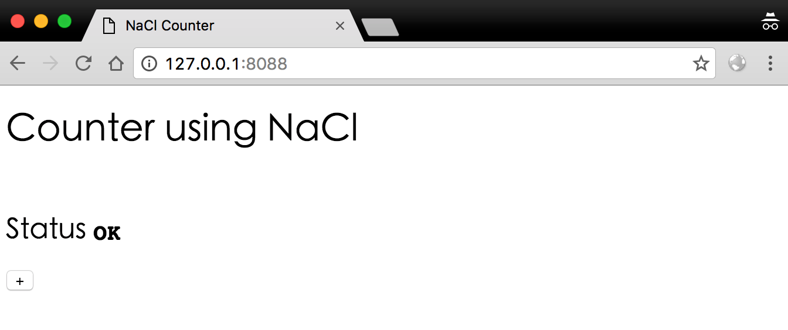
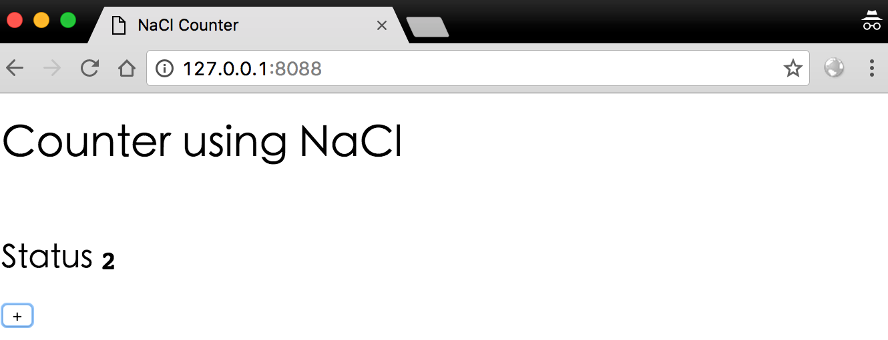
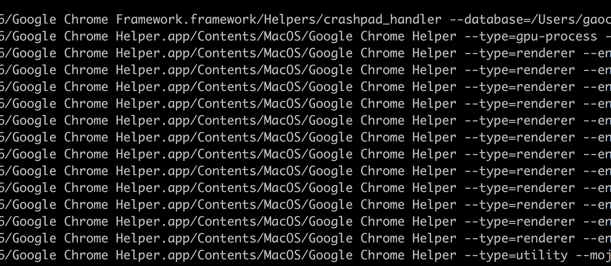
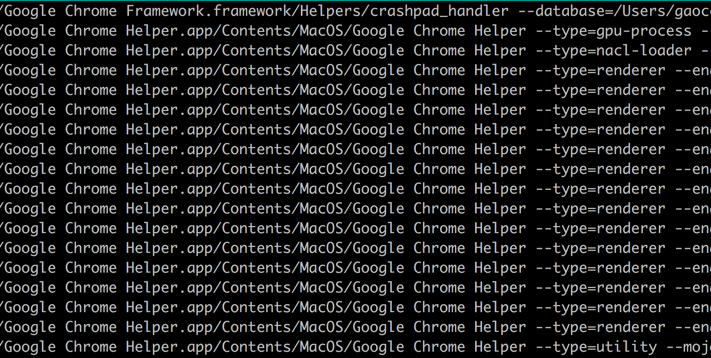

# NaCl的使用

### html



### js

```
function moduleDidLoad() {
  CounterModule = document.getElementById( 'counter' );
  var inc = document.getElementById( 'inc' );
  inc.onclick = function() { CounterModule.postMessage(1); }; 
}

function handleMessage(message_event) {
  updateStatus(message_event.data);
}
```

### cpp

```
void CounterInstance::HandleMessage( const pp::Var& var_message ) {
  if ( !var_message.is_number() )
    return; //Early exit
  auto x = var_message.AsInt();
  count += x;
  const pp::Var reply( count );
  PostMessage( reply );
}
```

### After



## Toolchain

工具链：

```
$  ls nacl_sdk/pepper_49/toolchain/mac_x86_glibc/bin
arm-nacl-gdb          i686-nacl-gccbug      i686-nacl-readelf     x86_64-nacl-elfedit   x86_64-nacl-ld.bfd
i686-nacl-addr2line   i686-nacl-gcov        i686-nacl-size        x86_64-nacl-g++       x86_64-nacl-nm
i686-nacl-ar          i686-nacl-gdb         i686-nacl-strings     x86_64-nacl-gcc       x86_64-nacl-objcopy
i686-nacl-as          i686-nacl-gfortran    i686-nacl-strip       x86_64-nacl-gcc-4.4.3 x86_64-nacl-objdump
i686-nacl-c++         i686-nacl-gprof       x86_64-nacl-addr2line x86_64-nacl-gccbug    x86_64-nacl-ranlib
i686-nacl-c++filt     i686-nacl-ld          x86_64-nacl-ar        x86_64-nacl-gcov      x86_64-nacl-readelf
i686-nacl-cpp         i686-nacl-nm          x86_64-nacl-as        x86_64-nacl-gdb       x86_64-nacl-size
i686-nacl-g++         i686-nacl-objcopy     x86_64-nacl-c++       x86_64-nacl-gfortran  x86_64-nacl-strings
i686-nacl-gcc         i686-nacl-objdump     x86_64-nacl-c++filt   x86_64-nacl-gprof     x86_64-nacl-strip
i686-nacl-gcc-4.4.3   i686-nacl-ranlib      x86_64-nacl-cpp       x86_64-nacl-ld
```

## 进程情况



